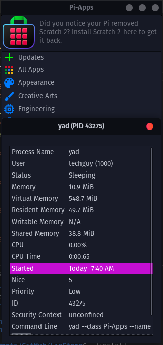

# Support Botspot
The creator of Pi-Apps, Botspot, is going through some tough times right now and you really should support him!

You can donate to him [here](https://github.com/sponsors/Botspot).

--------

# LinStore
The fastest and lightest app store for Linux.

## Install
To install LinStore, run the following command:
```bash
curl -s -L https://raw.githubusercontent.com/techguy16/LinStore/main/install | bash
```

## Installing Pi-Apps apps
LinStore has support to install non-package apps from Pi-Apps (I'm sorry Botspot). 

<code>install_package</code> and <code>remove_package</code> are separate scripts, unlike Pi-Apps which uses a large script (<code>manage</code>) for everything.

## FAQ
#### Is it lighter than Pi-Apps?
Yes, it is. In my testing, LinStore uses 8.8MiB of memory, wheras Pi-Apps uses 9.8MiB of memory. It's not much, but the CPU usage is also less.

|  |  |
|---|---|

## Supported distros
- Debian
- Ubuntu
- Linux Mint
- Pop!_OS
- Raspberry Pi OS
